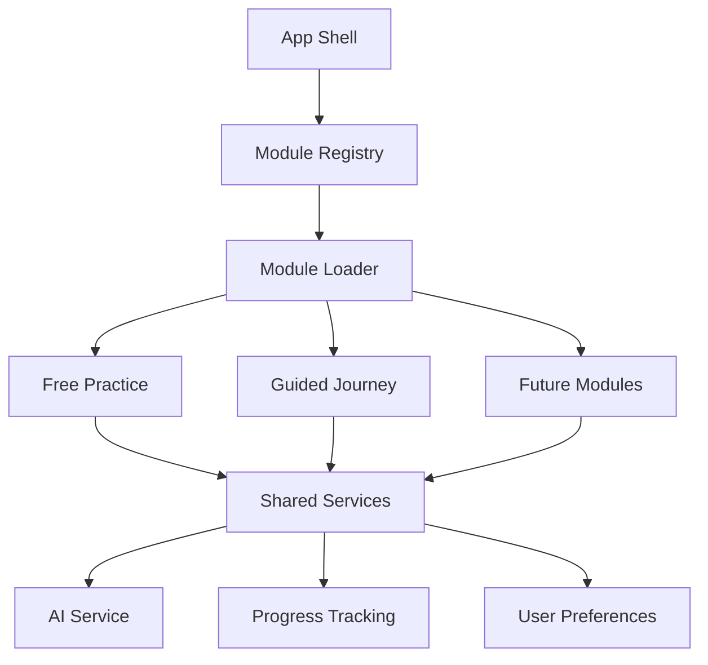

# Module System Overview

## Introduction

The Spanish Tutor MVP uses a modular architecture to organize features into self-contained, reusable units. This approach allows us to develop, test, and deploy features independently while maintaining a cohesive user experience.

## What Are Modules?

Modules are self-contained feature units that:
- Have their own UI components and business logic
- Define clear interfaces for integration
- Can be enabled/disabled independently
- Share common infrastructure while maintaining isolation

## Current Modules

### 1. Free Practice Module
**Purpose:** Allows users to practice Spanish through unstructured conversation
- AI-powered conversational partner
- Real-time feedback and corrections
- Vocabulary tracking
- Progress metrics

### 2. Guided Journey Module
**Purpose:** Provides structured learning paths with progressive difficulty
- Curated lesson plans
- Topic-based conversations
- Skill assessments
- Achievement tracking

## Future Modules

### 3. Daily News Module (Planned)
**Purpose:** Learn Spanish through current events
- Daily news articles in Spanish
- Difficulty-adjusted content
- Vocabulary highlights
- Discussion prompts

### 4. Grammar Coach Module (Planned)
**Purpose:** Focused grammar practice and explanations
- Interactive grammar exercises
- Rule explanations with examples
- Common mistake corrections
- Personalized practice recommendations

### 5. Book Club Module (Planned)
**Purpose:** Reading comprehension through literature
- Spanish book selections by level
- Chapter discussions
- Vocabulary lists
- Cultural context notes

## Benefits of Modular Architecture

### 1. **Independent Development**
- Teams can work on different modules simultaneously
- Reduced merge conflicts
- Faster feature delivery

### 2. **Scalability**
- Easy to add new modules without affecting existing ones
- Performance optimization per module
- Resource allocation control

### 3. **Maintainability**
- Clear boundaries reduce complexity
- Easier debugging and testing
- Simplified code reviews

### 4. **User Experience**
- Personalized feature selection
- Gradual feature rollout
- A/B testing capabilities

### 5. **Code Reusability**
- Shared components and utilities
- Consistent patterns across modules
- Reduced duplication

## Module Architecture

```
spanish-tutor-mvp/
├── src/
│   ├── modules/
│   │   ├── free-practice/
│   │   │   ├── components/
│   │   │   ├── hooks/
│   │   │   ├── services/
│   │   │   ├── types/
│   │   │   └── index.ts
│   │   ├── guided-journey/
│   │   │   ├── components/
│   │   │   ├── hooks/
│   │   │   ├── services/
│   │   │   ├── types/
│   │   │   └── index.ts
│   │   └── shared/
│   │       ├── components/
│   │       ├── hooks/
│   │       └── types/
│   └── core/
│       ├── module-registry/
│       ├── navigation/
│       └── config/
```

## Module Integration Flow



## Core Principles

### 1. **Separation of Concerns**
Each module handles its own:
- UI components
- State management
- API interactions
- Data models

### 2. **Shared Infrastructure**
All modules share:
- Authentication
- AI conversation engine
- Progress tracking
- User settings

### 3. **Loose Coupling**
Modules communicate through:
- Well-defined interfaces
- Event system
- Shared state store

### 4. **Progressive Enhancement**
- Core functionality works independently
- Enhanced features when modules interact
- Graceful degradation

## Module Lifecycle

1. **Registration**: Module registers with the system
2. **Initialization**: Module sets up required resources
3. **Activation**: Module becomes available to users
4. **Runtime**: Module handles user interactions
5. **Deactivation**: Module cleans up resources

## Configuration Example

```typescript
// Module configuration
export const freePracticeConfig: ModuleConfig = {
  id: 'free-practice',
  name: 'Free Practice',
  description: 'Practice Spanish through open conversation',
  icon: 'chat',
  route: '/practice/free',
  permissions: ['basic_user'],
  dependencies: ['ai-service', 'progress-tracker'],
  settings: {
    enableVoice: true,
    difficultyLevels: ['beginner', 'intermediate', 'advanced'],
    sessionDuration: 30 // minutes
  }
};
```

## Best Practices

1. **Keep modules focused** - Each module should have a single, clear purpose
2. **Minimize dependencies** - Reduce inter-module dependencies
3. **Use interfaces** - Define clear contracts between modules
4. **Document thoroughly** - Each module should have comprehensive documentation
5. **Test in isolation** - Modules should be testable independently

## Next Steps

- Review [Creating New Modules](./01-creating-new-modules.md) to learn how to build modules
- Check [Module API Reference](./02-module-api-reference.md) for detailed interface documentation
- See [Migration Guide](./03-migration-guide.md) for converting existing features to modules